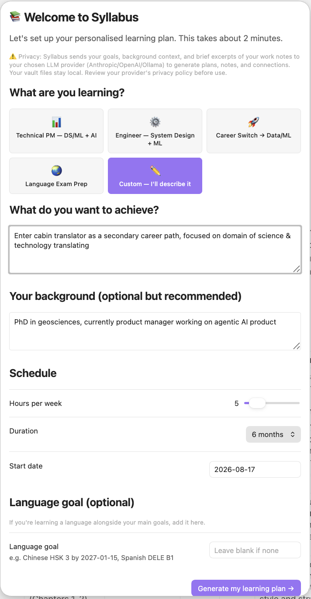
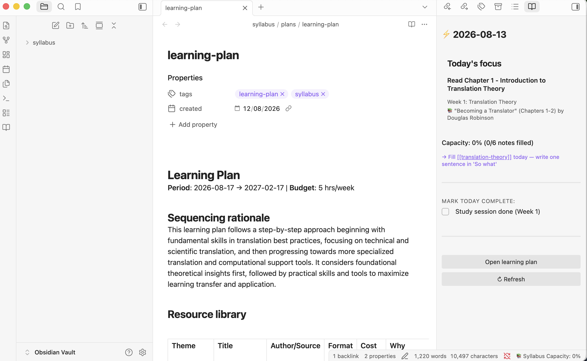

# Syllabus

**Autonomous learning agent for Obsidian** — connects what you study to what you write at work.

Syllabus generates a personalised learning plan, drafts concept notes, and surfaces relevant knowledge at the moment you're writing. Daily briefs, work-learning connections, and weekly reviews come to you as push notifications — no files to remember to open.

> **Note**: Syllabus makes LLM API calls to generate plans, draft notes, and create connections. Your vault files stay local. See Privacy section below.

---

## Screenshots

*Generating a personalised learning plan:*



*Daily brief sidebar — focus task, resources, and related notes:*



---

## Installation

### From Obsidian Community Plugins (recommended)
1. Open Obsidian → Settings → Community plugins
2. Turn off Restricted mode
3. Browse community plugins → search "Syllabus"
4. Install → Enable

### Manual installation
1. Download `main.js`, `manifest.json`, `styles.css` from the [latest release](https://github.com/utn100/obsidian-syllabus-plugin/releases)
2. Copy to your vault: `.obsidian/plugins/syllabus/`
3. Reload Obsidian → Settings → Community plugins → Enable Syllabus

---

## How it works

**Daily brief** → opens automatically when you launch Obsidian. Shows today's focus task, remaining resources, related notes to append to, and your language streak.

**Work-learning bridge** → save a note in your work folder. Syllabus finds the most relevant concept you've studied, generates a specific 2-sentence insight, and appends it to your note. A toast appears with View and Capture buttons.

**Quick capture** → tap Capture on any connection toast, or press `Cmd+Shift+M`. Write one sentence about how the concept applies to your work. This makes future connections specific instead of generic.

**Weekly review** → opens automatically on Sunday evening. Shows what you studied, what you applied at work, and one specific recommendation for next week.

---

## Features

- ✓ Generates a week-by-week learning plan from your goals
- ✓ Drafts concept notes for all plan topics (parallel generation)
- ✓ Daily brief sidebar — auto-opens once per day
- ✓ Work-learning bridge — fires on note save with 30s debounce
- ✓ Connection toasts with View/Capture actions
- ✓ Quick capture modal (`Cmd+Shift+M`)
- ✓ Weekly review with bridge quality stats and never-applied concepts
- ✓ Streak-at-risk toast for language goals
- ✓ Inbox processing — drop any note → concept note auto-created
- ✓ Plan refinement from feedback file
- ✓ Local semantic search (OpenAI embeddings)
- ✓ Works with Anthropic, OpenAI, or Ollama

---

## Setup

1. Install and enable the plugin
2. Open Settings → Syllabus
3. Choose your LLM provider and enter your API key
4. Set embedding backend to OpenAI API
5. `Cmd+P` → **Syllabus: Set up learning plan**
6. Pick a template, describe your goals, set duration
7. Wait ~60 seconds while the plan and notes generate
8. The daily brief opens automatically — you're ready

---

## Commands

| Command | What it does |
|---|---|
| Set up learning plan | Opens onboarding wizard |
| Open daily brief | Opens/focuses the brief sidebar |
| Open weekly review | Generates and opens weekly review |
| Capture insight | Opens quick capture modal |
| Refine plan from feedback | Applies feedback from `plans/plan-feedback.md` |
| Sync vault notes | Re-indexes all concept notes |
| Test LLM connection | Verifies your API key works |

---

## Vault structure

The plugin creates a `syllabus/` folder (configurable) in your vault:

```
syllabus/
├── concepts/          ← knowledge base (agent-drafted, you enrich)
├── plans/
│   ├── learning-plan.md
│   └── plan-feedback.md
├── daily-briefs/
├── weekly-reviews/
├── work-notes/        ← write here; bridge watches this folder
├── inbox/             ← drop notes here for processing
└── memory.json        ← agent state
```

---

## Privacy

**What is sent to your LLM provider:**
- Your learning goals and background context (during setup)
- Plan feedback text (during refine)
- Brief excerpts of your work notes (up to 1000 chars, during bridge)
- Content of files dropped in the inbox folder

**What stays local:**
- All vault files (notes, plans, concept notes)
- The semantic search index (`embeddings.json`)
- Your memory state (`memory.json`)
- API keys (stored in Obsidian's local plugin data only)

No analytics, no telemetry, no external servers beyond your chosen LLM provider. Consider marking sensitive work notes with `private: true` in frontmatter — bridge processing for those notes is not yet suppressed in v1.0 (planned for v1.1).

---

## Requirements

- Obsidian 1.4.0+
- An API key for Anthropic, OpenAI, or a running Ollama instance
- OpenAI API key for embeddings (or switch to local embeddings in settings — coming soon)

### Recommended plugins

| Plugin | Purpose | Required? |
|---|---|---|
| [Dataview](https://github.com/blacksmithgu/obsidian-dataview) | Live queries in dashboard.md | Recommended |

Syllabus will notify you at startup if Dataview is not installed. The dashboard file will still be created but queries won't render without it.

---

## Compatibility

- Desktop: macOS, Windows, Linux ✓
- Mobile: iOS, Android ✓ (requires cloud LLM provider)
